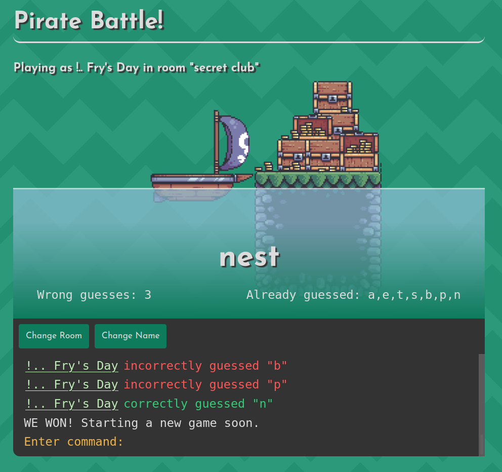

# Pirate Battle!

This is an online multiplayer hangman-style game.

It is written in Kotlin, HTML/CSS, and vanilla JavaScript. It uses STOMP over WebSockets to keep everyone in a game
updated. I am partly using this project to get more familiar with Kotlin and Spring.

There is no data storage, so a game will be deleted when the server restarts or when all the players leave a room. You
can easily spin up a new game or join someone else's by clicking *'Change Room'* and typing the name of the room you
want to play in.

## Screenshot

